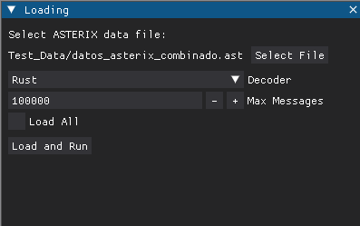
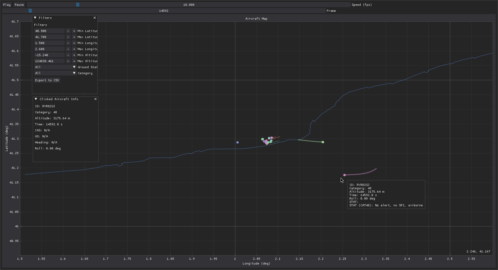

# ASTERIX Decoder & Dashboard

A comprehensive ASTERIX message decoder with an interactive DearPyGui dashboard for real-time aircraft tracking visualization.

## 🚀 Quick Start

### Option 1: Download Pre-built Executables (Recommended)

Download the latest release from [GitHub Releases](https://github.com/Sergiogd112/asterix_decoder/releases):

- **Linux**: `asterix-dashboard-linux` - Self-contained executable for Linux x86-64
- **Windows**: `asterix-dashboard-windows.exe` - Self-contained executable for Windows x86-64

**Running:**
```bash
# Linux
chmod +x asterix-dashboard-linux
./asterix-dashboard-linux

# Windows
asterix-dashboard-windows.exe
```

### Option 2: Install from Source

```bash
# Clone the repository
git clone https://github.com/Sergiogd112/asterix_decoder.git
cd asterix_decoder

# Install uv (Python package manager)
curl -LsSf https://astral.sh/uv/install.sh | sh

# Create virtual environment and install dependencies
uv venv
uv pip install -e .

# Run the dashboard
uv run python dashboard.py
```

## ✨ Features

- **Interactive Dashboard**: Real-time aircraft tracking on an interactive map
- **Play/Pause Controls**: Control animation playback with adjustable speed
- **Advanced Filtering**: Filter by location, altitude, ground status, and category
- **Data Export**: Export filtered data to CSV format
- **Multi-format Support**: Handles various ASTERIX categories (CAT21, CAT48, etc.)
- **Self-contained**: No Python installation required for pre-built executables

## 📋 Requirements

### Pre-built Executables
- **Linux**: glibc 2.17+ (most modern distributions)
- **Windows**: Windows 10+ with Visual C++ Redistributable
- No Python installation required

### From Source
- Python 3.10+
- Dependencies listed in `pyproject.toml`

## 🔧 Building from Source

See [BUILD_INSTRUCTIONS.md](BUILD_INSTRUCTIONS.md) for detailed build instructions, including:
- Local builds for Linux and Windows
- GitHub Actions automated builds
- Cross-platform compilation

## 📖 Usage

### 1. Launch and Load Data
1. Start the app (pre-built binary or `uv run python dashboard.py`).
2. In the `Loading` window, click **Select File** and choose an `.ast` capture.
3. Pick the decoder backend (`Rust` recommended) and optional **Max Messages** limit.
4. Press **Load and Run** to stream the capture into the dashboard.



### 2. Navigate the Dashboard
- Use the **Play/Pause** controls at the top to animate frames; drag the **Frame** slider for random access.
- Adjust **Speed (fps)** to fast-forward or slow down playback.
- Hover aircraft markers for rich tooltips with ID, altitude, roll, and CAT-specific status.
- Click an aircraft to pin its details in the `Clicked Aircraft Info` pane.



### 3. Filter and Export
- Toggle the `Filters` panel to constrain latitude/longitude, altitude, ground/airborne status, or ASTERIX category.
- Enable **Ground Status** or **Category** selectors to isolate specific traffic types.
- When satisfied, hit **Export to CSV** to save the currently filtered dataset for offline analysis.

## 🗂️ Project Structure

```
asterix_decoder/
├── decoder/           # Core ASTERIX decoding logic
├── dashboard.py       # Main DearPyGui dashboard
├── mapdata.py        # Map visualization data
├── Test_Data/        # Sample ASTERIX data files
├── BUILD_INSTRUCTIONS.md  # Detailed build guide
└── .github/workflows/    # Automated CI/CD
```

## 🤝 Contributing

1. Fork the repository
2. Create a feature branch
3. Make your changes
4. Add tests if applicable
5. Submit a pull request

## 📄 License

This project is licensed under the MIT License - see the LICENSE file for details.

## 🔗 Links

- [GitHub Repository](https://github.com/Sergiogd112/asterix_decoder)
- [GitHub Releases](https://github.com/Sergiogd112/asterix_decoder/releases)
- [Build Instructions](BUILD_INSTRUCTIONS.md)
- [Issues & Bug Reports](https://github.com/Sergiogd112/asterix_decoder/issues)